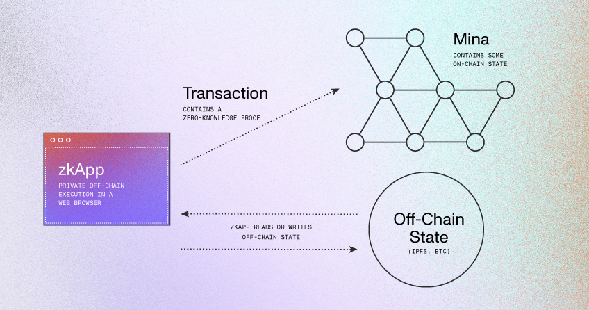

## MINA Protocol DOCS Tutorials

Tutorials projects for zkApp Developers on MinaProtocol's blockchain.

What are zkApps?
zkApps ("zero-knowledge apps") are Mina Protocol’s smart contracts powered by zero-knowledge proofs, specifically using zk-SNARKs.

zkApps use an off-chain execution and mostly off-chain state model. This allows for private computation and state that can be either private or public.

zkApps can perform arbitrarily-complex computations off chain while incurring only a flat fee to send the resulting zero-knowledge proof to the chain for verification of this computation, as opposed to other blockchains that run computations on chain and use a variable gas-fee based model.

* ### Tutorial 1: Hello World 
